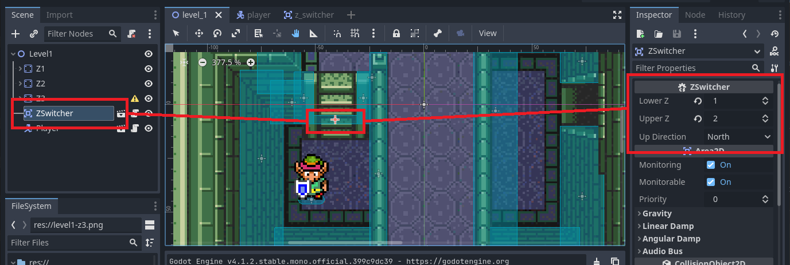

proof-of-concept collisions with different Z-layers, and "automatic" switching between these layers for any object which implements `IZTraveller`.

how it works:

* a level is conceptually divided into Z-layers, starting from 1

* the level has "Z*" nodes, labeled "Z1", "Z2", "Z3", etc.

  * The nodes' Z-index, Collision Layer, and Collision Mask should match the "Z" name, or else you're being confusing
  * These nodes contain the sprites and collision shapes for the layers they represent

* outside of these layers are:

  * any `IZTraveller`s, such as the player

  * any `ZSwitcher`s:

    * these are `Area2D`s with the `ZSwitcher` script attached. this script exposes three properties:
      * `LowerZ`
      * `UpperZ`
      * `UpDirection` (North, East, South, or West)

"the magic":

* when an object implementing `IZTraveller` leaves a `ZSwitcher`'s area:
  * if the traveller's Z equals the switcher's `LowerZ`, and is moving in the `UpDirection`, then its Z is set to the `UpperZ`
  * and the reverse, for moving from upper to lower z layers
* bonus: it's not important that the Collision Layer and Collision Mask be set properly for a `ZSwitcher`; the `ZSwitcher` script will configure itself based on the `LowerZ` & `UpperZ`